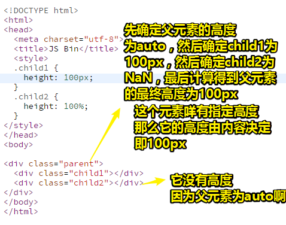
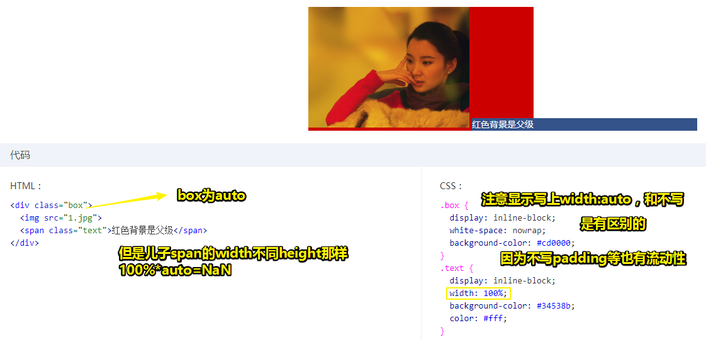
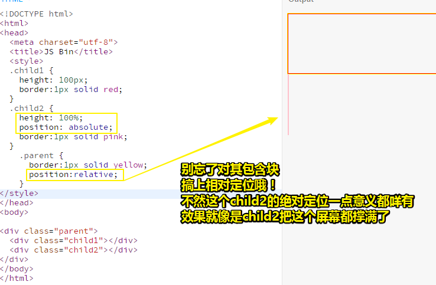
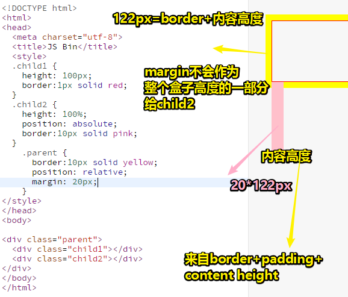
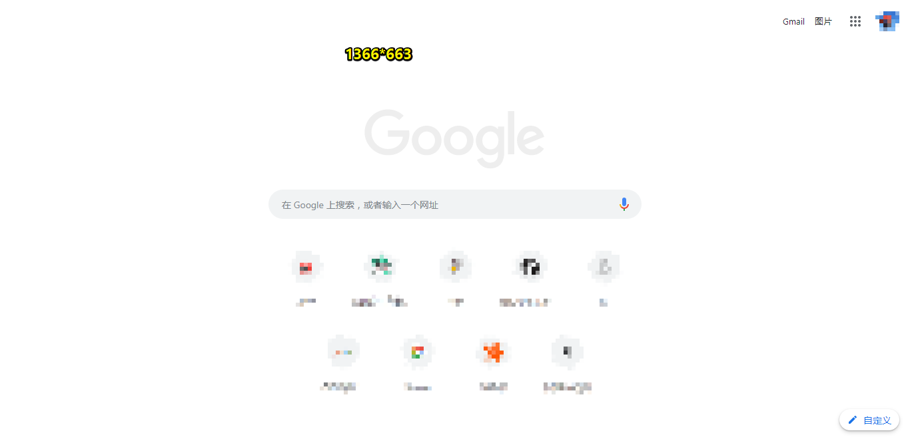
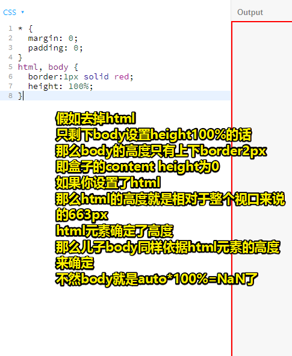

# README

## ★资料

**➹：**[前端每日实战：1# 视频演示如何用纯 CSS 创作一个按钮文字滑动特效 - 前端每日实战 - SegmentFault 思否](https://segmentfault.com/a/1190000014534572)

## ★小结

## ★Q&A

### ①BUTTON的空隙来源？

BUTTON的每个字母都是用span元素打包的，而span元素之间存在一个换行符等，总之看不见的空白都被压缩成一个空格了**✎：**


那么如何消除空隙呢？——让各个span元素紧挨着即可

可这就不利于阅读了啊！

所以可以使用jQuery来搞这事儿，**✎：**

1. 引入jQuery（我直接使用最新的）

2. demo，**✎：**

   ```js
   $('.removeTextNodes').contents().filter(function() {
       return this.nodeType === 3;
       }).remove();
   ```

理解一下这个demo？

1. 拿到这个匹配元素 `.removeTextNodes`的所有子节点——有text和span这两种节点
2. filter中的this是指当前的DOM元素，所以拿到了非元素节点——所有text节点
3. 移除这些非元素节点——返回所有text节点

对了，span元素之间有文本也会被移除的！可不仅仅是看不见的字符！

**➹：**[css - 这几个span之间为什么会有空隙呢？ - SegmentFault 思否](https://segmentfault.com/q/1010000010082045)

**➹：**[inline-block元素间间隙产生及去除详解](http://demo.doyoe.com/css/inline-block-space/)

为何要叫inline-block，直接说inline元素间的元素间隙不就好了吗？

有人说用 `white-space`，测试了一下没有效果！

###  ②常用的nodeType？

**➹：**[Node.nodeType - Web API 接口 - MDN](https://developer.mozilla.org/zh-CN/docs/Web/API/Node/nodeType)

- `Node.ELEMENT_NODE`： 1

  > 一个 元素 节点，例如 `<p>` 和 `<div>`。

- `Node.TEXT_NODE`： 3

  > `Element` 或者 `Attr` 中实际的  **文字**

### ③jQuery——contents()、not()、wrap()、filter()、remove()

| methods                                                 | sort     | use                                                          | input             | outpout |
| ------------------------------------------------------- | -------- | ------------------------------------------------------------ | ----------------- | ------- |
| [contents()](http://jquery.cuishifeng.cn/contents.html) | 筛选     | 查找匹配元素内部所有的子节点（包括文本节点）。如果元素是一个iframe，则查找文档内容 | 无参数            | jQuery  |
| [not()](http://jquery.cuishifeng.cn/not.html)           | 筛选     | 从匹配元素的集合中删除与指定表达式匹配的元素                 | `expr|ele|fn`     | 同上    |
| [wrap()](http://jquery.cuishifeng.cn/wrap.html)         | 文档处理 | 把所有匹配的元素用其他元素的结构化标记包裹起来               | `html|element|fn` | 同上    |
| [filter()](http://jquery.cuishifeng.cn/filter.html)     | 筛选     | 筛选出与指定表达式匹配的元素集合。                           | `expr|obj|ele|fn` | 同上    |
| [remove()](http://jquery.cuishifeng.cn/remove.html)     | 文档处理 | 从DOM中删除所有匹配的元素                                    | `[expr]`          | 同上    |

一些认识，**✎：**

1. []：可选
2. \|：或，总之选其中一个
3. 似乎都在返回一个jQuery对象
4. 可以为这个button添加没有空格的动效！

### ④如何让父元素为auto，子元素为100%的高度生效？

为什么会不生效？

根据浏览器渲染的基本原理 ：

> 先下载文档内容，加载头部的样式资源（如果有的话），然后按照从上而下、自外而内的顺序渲染 DOM 内容。 

下面这个列子就是如此：先渲染父元素，后渲染子元素，是有先后顺序的 



解析：

这是先静态渲染，一次到位，然后再计算得到父元素的最终高度！

总之，当父元素即包含块的高度没有显式指定（即**高度由内容决定**），并且**该元素不是绝对定位**，则计算值为
auto。 

一句话总结就是： `'auto' * 100/100 = NaN `

然而宽度却不是这样的，代码如下：



解析：

当渲染到父元素的时候，子元素的`width:100%`并没有渲染，宽度就是图片加文字内容的宽度；等渲染到文字这个子元素的时候，父元素宽度已经固定，此时的 `width:100%`就是已经固定好的父元素的宽度。宽度不够怎么
办？溢出就好了， overflow 属性就是为此而生的。

官方对宽度的解释：

> 如果包含块的宽度取决于该元素的宽度，那么产生的布局在 CSS 2.1中是未定义的  

这里的未定义换言之就是说「规范没有明确表示该怎样，浏览器可以自己根据理解去发挥。 」

然而根据我的测试，这里的宽度布局效果在各个浏览器下都是一致 的

可见这里的宽度的规范和高度的规范定义就有明显 的区别，即父元素高度明确是auto，那么子元素为高度百分比计算自然无果， 而**width 却没有这样的说法**，因此，就按照包含块**真实的计算值作为百分比计算的基数**。 

那么我们该如何让元素支持 height:100%效果呢？

1. 设定显式的高度值 。比如设置父元素（包含块）的为height:600px，或者可以生效的百分比值高度。 常见的代码如下：

   ```css
   html, body {
   	height: 100%;
   }
   ```

   > 我觉得这样做没有用呀！因为包含块的height起初就是auto的呀，父元素body计算拿到663px的高，但是parents元素此时还是auto值呀！auto*663=NaN
   >
   > 然后计算child1的高，计算child2的高（100%*NaN=NaN）还是0像素
   >
   > 计算两个子元素的高度之后就可以确定，parents元素的高了。
   >
   > 总之还是后面那种姿势比较靠谱。

2. 使用绝对定位 ：

   ```css
   div {
       height: 100%;
       position: absolute;
   }
   ```

   测试如下：

   

   > 图中的border效果不明显，做了以下改进：
   >
   > 
   >
   > 注意child2的宽度为20px，可不是来自于包含块parent的margin值，而是自身的左右border叠加的10px。
   >
   > margin值只管布局就好了，不要涉及计算哈！
   >
   > **需要注意的是，child2如果是绝对定位且不写width和height值的话，那么其子元素的宽高百分比就是相对于border-box的（如图中所示child2的content高为102px，来自于父元素parernt的boder-box高度 100+1+1=102px），如果不是使用绝对定位姿势，而是显示设置高度，那么其子元素的宽高百分比就是相对于content box  计算的。**
   >
   > 如果你不给包含块相对定位的话，那么child2的高度就是663+20（border）=683，而这个663（`document.body.clientHeight`，咩有滚动条情况下的值）刚好就是child2的内容高度（可视区域高度）！说白就是**相对视口区域的高度决定这个绝对定位元素的高度**！所以这时候会溢出html这个根盒子！
   >
   > **➹：**[饥人谷JS Bin](http://js.jirengu.com/giloj/3/edit)
   >
   > 自己截图测试：
   >
   > 
   >
   > 包含块的高度还是102+20（border） = 122
   >
   > child1为100+2（border） = 102
   >
   > 所以你给上相对定位才有意义！

**➹：**[深入理解CSS系列（二）：为什么height:100%不生效？ - ChessZhang - 博客园](https://www.cnblogs.com/yugege/p/9264319.html)

### ④下边这段代码的作用？

```css
html, body {
	height: 100%;
}
```

> 注意：这高度的最大值是663px即整个视口的高度。如果body的子元素，即其内容叠加起来的高度超过663px，那么就会溢出！



再次回顾这句话：

> 如果包含块的高度没有显式指定（即高度由内容决定），并且该元素不是绝对定位，则计算值为
> auto。 