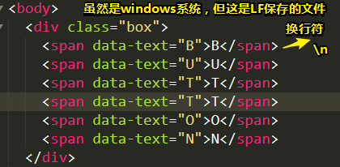

# README

## ★资料

**➹：**[前端每日实战：1# 视频演示如何用纯 CSS 创作一个按钮文字滑动特效 - 前端每日实战 - SegmentFault 思否](https://segmentfault.com/a/1190000014534572)

## ★小结

## ★Q&A

### ①BUTTON的空隙来源？

BUTTON的每个字母都是用span元素打包的，而span元素之间存在一个换行符等，总之看不见的空白都被压缩成一个空格了**✎：**



那么如何消除空隙呢？——让各个span元素紧挨着即可

可这就不利于阅读了啊！

所以可以使用jQuery来搞这事儿，**✎：**

1. 引入jQuery（我直接使用最新的）

2. demo，**✎：**

   ```js
   $('.removeTextNodes').contents().filter(function() {
       return this.nodeType === 3;
       }).remove();
   ```

理解一下这个demo？

1. 拿到这个匹配元素 `.removeTextNodes`的所有子节点——有text和span这两种节点
2. filter中的this是指当前的DOM元素，所以拿到了非元素节点——所有text节点
3. 移除这些非元素节点——返回所有text节点

对了，span元素之间有文本也会被移除的！可不仅仅是看不见的字符！

**➹：**[css - 这几个span之间为什么会有空隙呢？ - SegmentFault 思否](https://segmentfault.com/q/1010000010082045)

**➹：**[inline-block元素间间隙产生及去除详解](http://demo.doyoe.com/css/inline-block-space/)

为何要叫inline-block，直接说inline元素间的元素间隙不就好了吗？

有人说用 `white-space`，测试了一下没有效果！

###  ②常用的nodeType？

**➹：**[Node.nodeType - Web API 接口 - MDN](https://developer.mozilla.org/zh-CN/docs/Web/API/Node/nodeType)

- `Node.ELEMENT_NODE`： 1

  > 一个 元素 节点，例如 `<p>` 和 `<div>`。

- `Node.TEXT_NODE`： 3

  > `Element` 或者 `Attr` 中实际的  **文字**

### ③jQuery——contents()、not()、wrap()、filter()、remove()

| methods                                                 | sort     | use                                                          | input             | outpout |
| ------------------------------------------------------- | -------- | ------------------------------------------------------------ | ----------------- | ------- |
| [contents()](http://jquery.cuishifeng.cn/contents.html) | 筛选     | 查找匹配元素内部所有的子节点（包括文本节点）。如果元素是一个iframe，则查找文档内容 | 无参数            | jQuery  |
| [not()](http://jquery.cuishifeng.cn/not.html)           | 筛选     | 从匹配元素的集合中删除与指定表达式匹配的元素                 | `expr|ele|fn`     | 同上    |
| [wrap()](http://jquery.cuishifeng.cn/wrap.html)         | 文档处理 | 把所有匹配的元素用其他元素的结构化标记包裹起来               | `html|element|fn` | 同上    |
| [filter()](http://jquery.cuishifeng.cn/filter.html)     | 筛选     | 筛选出与指定表达式匹配的元素集合。                           | `expr|obj|ele|fn` | 同上    |
| [remove()](http://jquery.cuishifeng.cn/remove.html)     | 文档处理 | 从DOM中删除所有匹配的元素                                    | `[expr]`          | 同上    |

一些认识，**✎：**

1. []：可选
2. \|：或，总之选其中一个
3. 似乎都在返回一个jQuery对象
4. 可以为这个button添加没有空格的动效！

