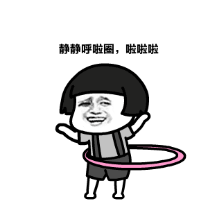
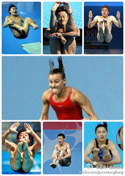
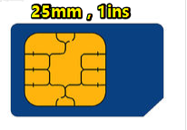
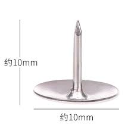
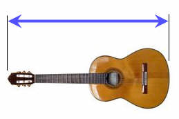
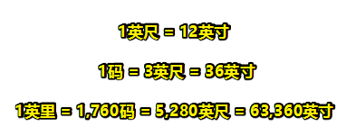
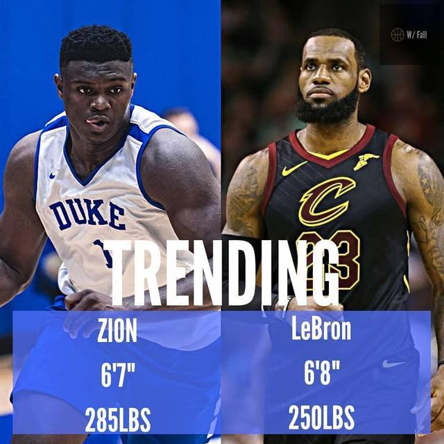
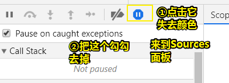

# 如何用纯 CSS 创作一个矩形旋转 loader 特效

## ★资源

**➹：**[前端每日实战：2# 视频演示如何用纯 CSS 创作一个矩形旋转 loader 特效 - 前端每日实战 - SegmentFault 思否](https://segmentfault.com/a/1190000014553745#articleHeader4)

**➹：** <https://scrimba.com/c/cJMkwH9>

## ★源码

**➹：**[front-end-daily-challenges/002-rectangular-rotating-loader-animation at master · comehope/front-end-daily-challenges](https://github.com/comehope/front-end-daily-challenges/tree/master/002-rectangular-rotating-loader-animation)

**➹：**[fe-daily-challenges-2018/002-rectangular-rotating-loader-animation at master · ppambler/fe-daily-challenges-2018](https://github.com/ppambler/fe-daily-challenges-2018/tree/master/002-rectangular-rotating-loader-animation)

## ★预览效果

- [Me](./index.html)
- [Teacher](./demo/index.html)

## ★知识点

- @keyframes <https://developer.mozilla.org/en-US/docs/Web/CSS/@keyframes>
- animation-duration <https://developer.mozilla.org/en-US/docs/Web/CSS/animation-duration>
- rotateY <https://developer.mozilla.org/en-US/docs/Web/CSS/transform-function/rotateY>
- nth-child <https://developer.mozilla.org/en-US/docs/Web/CSS/:nth-child>
- z-index <https://developer.mozilla.org/en-US/docs/Web/CSS/z-index>
- ::before <https://developer.mozilla.org/en-US/docs/Web/CSS/::before>
- ::after <https://developer.mozilla.org/en-US/docs/Web/CSS/::after>
- [绝对定位后元素的宽高如果用百分比表示的计算方法 - HansExploration的博客 - CSDN博客](https://blog.csdn.net/HansExploration/article/details/80735110)
- [CSS Transform / Transition / Animation 属性的区别 - 牛角堂](http://blog.iwege.com/posts/the-different-between-transform-transition-animation.html)
- [好吧，CSS3 3D transform变换，不过如此！ « 张鑫旭-鑫空间-鑫生活](https://www.zhangxinxu.com/wordpress/2012/09/css3-3d-transform-perspective-animate-transition/)
- [CSS3常用功能的写法 - 阮一峰的网络日志](http://www.ruanyifeng.com/blog/2010/03/cross-browser_css3_features.html)
- [CSS动画简介 - 阮一峰的网络日志](https://www.ruanyifeng.com/blog/2014/02/css_transition_and_animation.html)
- [实用的 CSS — 贝塞尔曲线(cubic-bezier) - 心有猛虎，细嗅蔷薇 - SegmentFault 思否](https://segmentfault.com/a/1190000004618375)
- [rotateX() - CSS: Cascading Style Sheets - MDN](https://developer.mozilla.org/en-US/docs/Web/CSS/transform-function/rotateX)
- [rotateZ() - CSS: Cascading Style Sheets - MDN](https://developer.mozilla.org/en-US/docs/Web/CSS/transform-function/rotateZ)

## ★总结

- 父元素或祖先元素定位了，那么absolute化的子元素，假如其宽高设定的值是百分比，那么百分比所乘的基数是父元素或祖先元素的content + padding（不包括border）（计算过后的）

  还有如果该子元素也设置了margin的百分比值，那么所乘基数只有父元素或祖先元素的宽度（计算过后的），即上下左右都是以宽度为基数的，而不是上下是以高度为基准的！

- 把transform的rotateY看做是翻牌效果，即把网页当作是地面，然后某个设置了该transform的元素，当作是一张扑克牌。或者也可以看做是烤羊肉串时的转转圈圈。

  或者可以看做是跳钢管舞的美女，即我们怎么看钢管的，那么就怎么看网页！

  

  还可以看做是转呼啦圈：

  

  rotateX则是你面朝跳水看台时，运动员从高台跳下来时的正面旋转

  

  或者是体操单杆运动：

  

  而rotateZ则是你面朝一个大风车，在原地转圈圈。

  

  总之，**要想理解一个东西，最好先有一些感性的认识，即情感化的认识，如生活中对某些现象的感官化认识，可以映射到我们想要理解的知识点，如transform这个3D变换**

- 我们用了animation来做动画，其中用到了一个linear值，其等价于 `cubic-bezier(0, 0, 1, 1)`或者 `cubic-bezier(1, 1, 0, 0)`。

- CSS动画有两大组成部分：transition和animation。

  关于transition的由来：「**在CSS 3引入Transition（过渡）这个概念之前，CSS是没有时间轴的。也就是说，所有的状态变化，都是即时完成**」，其**优点在于简单易用，但有几个很大局限**，比如「它只能定义开始状态和结束状态，不能定义中间状态，也就是说只有两个状态」等

  关于animation的由来：为了解决transition的局限问题而提出的。它的基本用法是**需要指定动画一个周期持续的时间，以及动画效果的名称。**

## ★Q&A

### ①body没有高度，为啥设置背景色会让整个视口变色呢？

当`<html>`标签无背景样式时，`<body>`的背景色其实不是`<body>`标签的背景色，而是浏览器的。

一旦html标签含有背景色，则`<body>`的背景色变成了正常的`<body>`标签（一个实实在在，普普通通标签）的背景色，而此时的`<html>`标签最顶级，背景色被浏览器获取，成为浏览器的背景色。

**➹：**[对html与body的一些研究与理解 « 张鑫旭-鑫空间-鑫生活](https://www.zhangxinxu.com/wordpress/2009/09/%E5%AF%B9html%E4%B8%8Ebody%E7%9A%84%E4%B8%80%E4%BA%9B%E7%A0%94%E7%A9%B6%E4%B8%8E%E7%90%86%E8%A7%A3/)

### ②移动端的html的font-size如何设置？

用媒体查询来设置html的font-size：

```css
@media screen and (min-width: 320px) {
    html {font-size: 14px;}
}
 
@media screen and (min-width: 360px) {
    html {font-size: 16px;}
}
 
@media screen and (min-width: 400px) {
    html {font-size: 18px;}
}
 
@media screen and (min-width: 440px) {
    html {font-size: 20px;}
}
 
@media screen and (min-width: 480px) {
    html {font-size: 22px;}
}
 
@media screen and (min-width: 640px) {
    html {font-size: 28px;}
}

```

这样一来，同样一个页面下的元素，在不同的屏幕尺寸下，就会呈现出不一样的大小了！当然前提是，你这个元素涉及px单位的属性，都转为rem单位才行！

总之，通过「媒体查询+rem」可以让一个元素的盒子大小在不同的屏幕尺寸下会有等比的缩放！这样一来，元素看起来大小就是合适的！而不是PC端看这个元素很正常，但是移动端看这个元素就大得离谱了！

**➹：**[移动端应该如何动态设置字体大小？ - web开发 - SegmentFault 思否](https://segmentfault.com/a/1190000004189237)

### ③关于像素的那些事儿？

> 想到一个比喻：之前看张鑫旭大佬一书说到把CSS世界看做是一个动漫世界！一个世界即一个地球对吧！
>
> 现在为了理解px这个相对单位，我引入了平行世界的概念，即一个设备即可看做是不同的平行世界，或者说是一个宇宙，总之不同的平行世界下，即不同的设备下，这个px所表示的「大小」是不同的。
>
> 像是日常的10cm大小的物体，平行世界也是如此的大小，只是名字不同而已，比如叫10zn，反正这是一种约定的大小。而px则不是，它受到硬件的影响，这种影响是我们前端开发者不可控的。

**➹：**[CSS像素、物理像素、逻辑像素、设备像素比、PPI、Viewport · Issue #21 · jawil/blog](https://github.com/jawil/blog/issues/21)

### ④关于英寸单位换算的那些事儿？

> 我们可以测量物体有多长、多高或有多远。这些都是长度。
>
> 最常见的测量单位：mm、cm、m、km（千米，公里）
>
> **➹：**[Metric Length](https://www.shuxuele.com/measure/metric-length.html)

1英寸 = 2.54cm

在美国，通常人们都可以估计出一件东西大约有多少英寸长

同样，在中国，我们也可以估计出一件东西大约有多少里厘米长

生活中，一个1元硬币的直径是25mm，即大约是1英寸，当然，你可以把硬币看做是1英寸长，这点误差对于我们估算某个东西有多长，并咩有多大影响，反正又不是精确度量，而是用于「装逼」之技（**我只要看一眼就知道这东西有多长，你说厉害不？**）而已！


> 上边这个是第五套人民币第二个版本的1元硬币，直径是22.5毫米（0.89英寸）
>
> 而第五套人民币第一个版本的1元硬币才是25mm的直径：
>
> 
>
> 其背面是牡丹花：
>
> 

还有SIM标准卡的尺寸为 `25mm×15mm×0.8mm`：



> 是1in，而不是1ins

那么1cm长的东西呢？——图钉、订书针等



那么关于英寸的单位换算呢？

- 1英尺 = 12英寸（12英寸连在一起就是一**英尺**），它的出现是为了替代用脚来量度东西的长度，毕竟每个人的脚长度都不同呀，**大概是30cm**

  

- 1码 = 3英尺（3英尺连在一起就是一**码**），**大概是90cm**，下边这把吉他大约就是1码长：

  

- 1英里 = 1,760码 = 5,280英尺（1,760码连在一起就是一**英里**），这个单位通常是**用来测量两个相隔很远的地方之间的距离**。大部分人用英里来做驾驶、骑自行车和慢跑距离的单位。毕竟英里表示相当长啊！映射到生活的度量，大约是2000步、你20分钟步行的距离

> 有段文字一直才重复，那就是「**666xx连在一起就是1zz**」，为啥要重复呢？因为这重复的话，是需要深刻记得脑子里边的！因为它告诉了你这个1码概念是怎么来的？这个1英里概念是怎么来的……
>
> 请记住为什么，而不是什么！

总之：



> 一英里是 **1.609344**千米（**我大概算着是1.584千米**）
>
> 快速但不绝对准确的转换：
>
> 我们知道斐波那契数列（每项是前两项的和）：**0、1、1、2、3、5、8、13、21、34、55、89、144……**
>
> 然后，头几个数不管用，但从 "3、5"开始：
>
> -  "3、5"：**3英里大约是 5千米** （3×1.609344 = 4.828032）
> - "5、8"：**5英里大约是 8千米** （5×1.609344 = 8.04672）
> - "8、13"：**8英里大约是 13千米** （8×1.609344 = 12.874752）
>
> 所以「55英里是多少千米？」。显然是89千米呀！（`55英里 × 1.609344 米m/英里 = 88.51392千米`）

我们知道今年2019年的nba状元大热锡安体侧数据：



可以看到锡安是6尺7寸（6英寸7寸），也就是 `(6*12+7)*2.54cm=200.66cm=2米`，而老詹则是 `203.2cm=2米03`

**➹：**[美国标准长度](https://www.shuxuele.com/measure/us-standard-length.html)

**➹：**[SIM卡_百度百科](https://baike.baidu.com/item/SIM%E5%8D%A1?fromtitle=%E6%89%8B%E6%9C%BA%E5%8D%A1&fromid=3027889)

**➹：**[谁帮忙测一测1块钱硬币宽度多少厘米 还有 20RMB宽度多少 不是长度_百度知道](https://zhidao.baidu.com/question/139654168862623365.html)

**➹：**[1元人民币硬币 - 维基百科，自由的百科全书](https://zh.wikipedia.org/wiki/1%E5%85%83%E4%BA%BA%E6%B0%91%E5%B8%81%E7%A1%AC%E5%B8%81)

### ⑤每次打开chrome的控制台，然后刷新页面，就会自动打断点，至此就会卡住页面，那么如何设置为不打断点呢？



> 我测试了一下，只需要把第二步的勾勾去掉就可以了。第一步点不点都无所谓。

**➹：**[怎么关闭谷歌浏览器自动断点调试？打开网页按F12之后，打开任何网页都会自动断点调试js - microcosmv的博客 - CSDN博客](https://blog.csdn.net/microcosmv/article/details/60793882)

### ⑥3个span 加上z-index属性 和没加 效果一样啊 ... 这里为啥要加z-index属性啊？？

> 把动画时间放慢4倍到 16s/8s/4s，就可以看到不加 z-index 的效果了，是有差别的

