# 如何用纯 CSS 创作一个容器厚条纹边框特效

## ★资源

**➹：**[前端每日实战：3# 视频演示如何用纯 CSS 创作一个容器厚条纹边框特效 - 前端每日实战 - SegmentFault 思否](https://segmentfault.com/a/1190000014576519)

**➹：** <https://scrimba.com/c/cPvn6tE>

## ★源码

**➹：**<https://github.com/comehope/front-end-daily-challenges/tree/master/003-diagonal-stripe-border-effects>

## ★预览效果


## ★知识点


## ★总结


## ★Q&A

### ①linear-gradient？

关于渐变，它是**一种应用于平面的视觉效果**，可以从**一种颜色逐渐地转变成另外一种颜色**，故可以创建类似于彩虹的效果渐变可以应用在**任何可以使用图片的地方**。

举例来说，你可以指定这么一个渐变：

顶部的颜色是红色，中间的是蓝色，底部为黄色来作为div的背景色。

那么我们该如何实现渐变呢？——很简单，CSS给了我们以下这几种方式实现（它们都是渐变函数，是`background`这位魔法师可以使用的其中一门魔法，而使用这类魔法之后，显而易见的就是，我们**不用再写背景图片的URL**，总之，**渐变函数可以用来代替图片URL**）：

1. `background: linear-gradient(#f69d3c, #3f87a6);`：线性渐变

   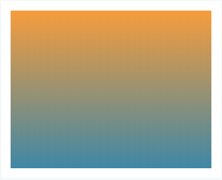

2. `background: radial-gradient(#f69d3c, #3f87a6);`：径向渐变

   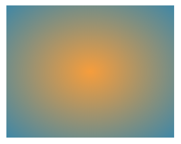

3. `background: repeating-linear-gradient(#f69d3c, #3f87a6 50px);`：重复的线性渐变

   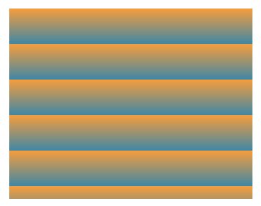

4. `background: repeating-radial-gradient(#f69d3c, #3f87a6 50px);`：重复的径向渐变

   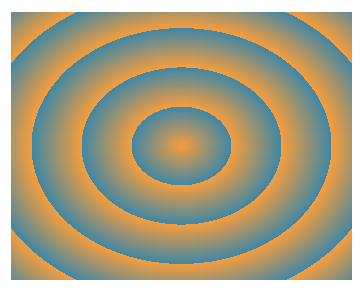

   这看起来有锯齿呀！一点也不圆润

5. `background: conic-gradient(#f69d3c, #3f87a6);`：圆锥形渐变

   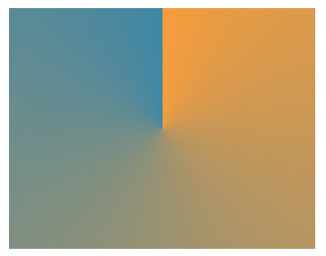

   这个真是奇葩……

需要注意的是：

1. **`<gradient>`** （[CSS数据类型](https://developer.mozilla.org/en-US/docs/Web/CSS/CSS_Types)的一种）是 `<image>` 的一种特殊类型，简单来说，就是它的子类型，表示由**两种或多种颜色**之间的渐进式的过渡组成，总之，就是你使用了渐变函数，那么你就**不能只写一个颜色参数值，毕竟你不能抢了背景色的活儿啊**！

2. 具体尺寸将与其（CSS渐变）**所应用的元素的尺寸相匹配**，总之CSS渐变它没有没有[内在尺寸](https://developer.mozilla.org/en-US/docs/CSS/image#no_intrinsic)，就像个不失真的背景图片一样。

3. 渐变的显示区域，边框下也会显示，即  它的显示区域就是元素的`border-box`区域

   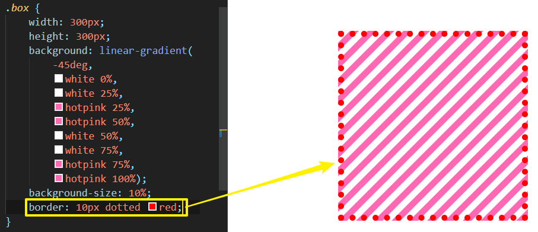
   
   > 背景颜色和背景图片也是如此。可见渐变函数的出现，是实打实的减少了请求背景图片为渐变色图片的url呀！

以下讨论的是`linear-gradient`：

一些概念：

1. gradient box：需要应用渐变的元素被称为**渐变容器或者说是渐变框**

2. gradient line：在渐变容器中，穿过容器中心点和颜色停止点（color stops）连接在一起的线称为**渐变线**

3. gradient angle：使用`linear-gradient`是通过渐变的角度来控制渐变的方向

4. color stops：它是线性渐变函数的第二个参数（或者说第3个、第4个（如果有的话）也是这样的参数……），表示终止点的颜色，即接受一系列颜色节点

   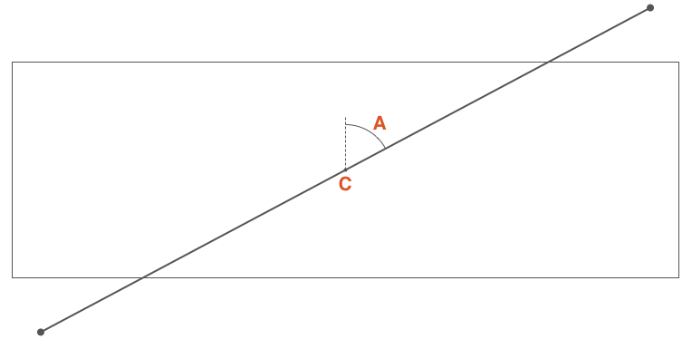

   `C`点为渐变容器的中心点，`A`是通过`C`点垂直线与通过`C`点渐变线的夹角，这个角称为**渐变角度**。

如何定义渐变角度？——有两种姿势：

1. 使用关键字： *to top*, *to bottom*, *to left*, *to right*, *to top right*, *to top left*, *to bottom right*, *to bottom left*
2. 使用「数字+单位」： *45deg, 1turn, …*

不写渐变角度？——我们知道线性渐变的语法：

`linear-gradient([<angle> | to <side-or-corner>]? , <color-stop-list>)`

第一个参数是可选的，既然是可选的，那么它是有默认值的，其默认值为*to bottom*，等价于`180deg`或者 `.5turn`：

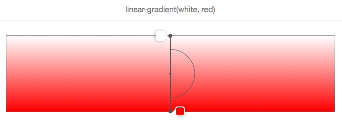

> 注意：红色色标是指南针的箭头，默认用圆规从上到下画了个半圆

同理，如果你写了 `0deg`，那么其值等价于 *to top*

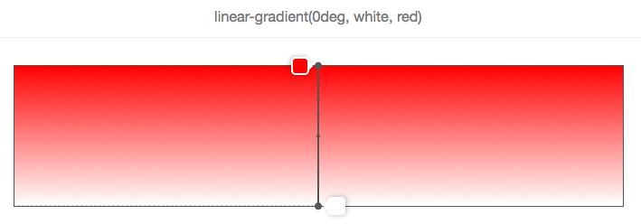

> 此时的箭头在容器的top点，用圆规从下到上画了个半圆。换而言之，线性渐变颜色默认是从上到下的，与传入的颜色色标参数顺序是一一对应的

渐变角度关键字取决于渐变框的尺寸：

何以见得？

举个栗子你就明白了：

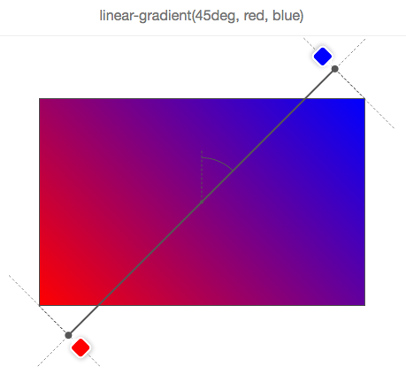

`45deg`等价于 `to top right`，但这并不意味着渐变线穿过右上角，毕竟这TM不是一个正方形呀！而是一个长方形呀！总之，你要通过角度和通过元素中心点的垂直线来确定渐变线，而且你要渐变线的箭头指向是哪个方向，毕竟我们要确定填充色标的顺序呀！

> 我有疑问：它是个矩形，为啥45deg的渐变颜色填充却是对角的？真是无法理解呀！或许自己可以在脑海中把这个渐变容器补充完整为一个正方形。
>
> 我测试了一下：
>
> 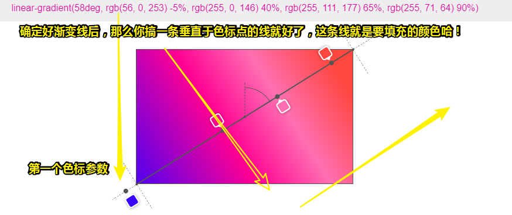
>
> 难怪矩形的顶点有个十字线。
>
> 所以我们写上45deg所呈现的渐变效果，真得是如同自己在这个渐变框里边画一条条的45deg角的斜线。
>
> 
>
> **➹：**[CSS linear-gradient overlay](https://codepen.io/captainbrosset/pen/ByqRMB)

一图告知你**渐变角度动态变化时，渐变线是怎么移动的**：

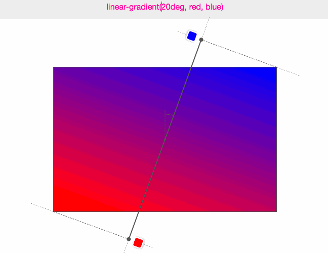

关于渐变线长度：


在上图中，我们可以看到，颜色色标脱离到容器之外了，即渐变线可以大于元素容器的对角线，而其最小的长度刚好为元素的高度。当然，我们有个公式可以计算它的确切高度：

```
abs（W * sin（A））+ abs（H * cos（A））
```

> W为渐变框的宽，H为高度，A为渐变角。可见这几个值都是已知的。


关于渐变色节点（色标，Color stops）：

1. 每个色标的定义（以逗号分割）：

   ```
   <color> [<percentage> | <length>]?
   ```

2. 色标的第二个值是可选的，用于确定色标在渐变线上的位置。

3. 如果没有显式指定颜色在渐变线上的位置，这将交给浏览器来确定颜色在渐变线上的位置：

   1. 默认情况下，即最简单的情况下，只有2种颜色：**颜色1将被置于0％（渐变线的开始），颜色2将被置于100％（渐变线的末端）。**
   2. 如果添加第三种颜色：**颜色1仍为0％，颜色2为50％，颜色3为100％，依此类推。**
   
   举个栗子，定义了5个色标：
   
   
   
   可见，浏览器已将色标各自的位置计算为0％，25％，50％，75％，100％，而这样做的原因是**它们将沿着渐变线平均（或者说是均匀）分布渐变颜色。**

4. 在渐变线上**显式自定义渐变颜色在渐变线的位置**，每个位置可以用百分比表示（**相对于渐变线计算**），也可以是**任何一个CSS长度单位**：

   如这样：

   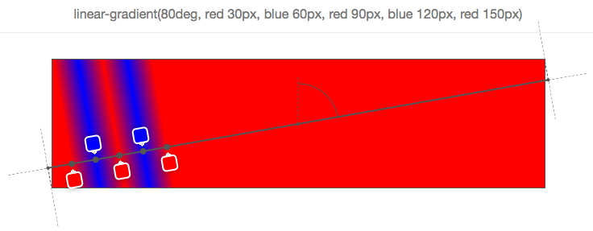

   可见，5个色标中的每一个都有位置，以像素为单位，而这些位置是从渐变线的起点计算出来的。

   > 每个色标所对应的那一点就是我们在CSS里边所写的颜色，色标之间的过渡，是渐进式的变化的，这种颜色的填充是浏览器帮我们勾画出来的。

利用色标在渐变线上的位置，可以想出各种不错的效果：

1. 使用渐变函数但完全不绘制任何渐变效果，即存粹的呈现多种颜色：

   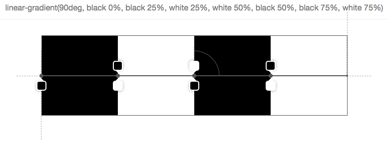

   有7个色标，它们的组织方式是，除了第一个色标以外，下一个色标的开始与上一个色标完全位于相同的位置，而这意味着浏览器不需要使用颜色渐变来填充2个色标之间的空间。

   这像是棋盘图：

   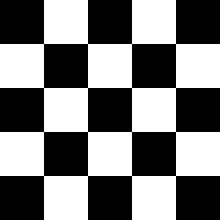

2. 把定位的色标和没有定位的色标混合起来：

   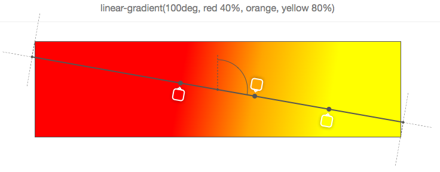

   可见，我们这样做使浏览器做了更多的工作，毕竟，我们要求它自动分配我们没有写位置的色标。

   那么这个orange色标的位置是如何确定的呢？

   由于它的左右直接邻居都有位置，所以很容就能确定它的位置了，即为直接邻居之间的中心点。

   **但如果有多个颜色没有指定位置，或者前一个或后一个都没有指定位置，那它就变得越来越复杂。** 

   > 自己定义一个概念：
   >
   > 有两种色标，一种显示给了位置，一种没有给位置，而说到色标混合，指的是两种色标的混合。

3. 色标混合之复杂情况（**头尾色标没位置**）：

   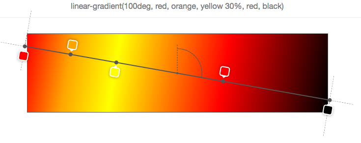

   可见，只有黄色有位置（位于30%），其余的色标都没有位置。

   为了很好地分配其余的色标，于是，浏览器将第一个放在0％，最后一个放在100％，而这样一来剩下的色标都有位置了，即它们的直接邻居都是有位置的，所有orange最终在0％至30％之间，red（最后那个）最终在30％~100％之间，总之，它们俩都是在中心位置。

   再复杂点（**头尾色标有位置**）：

   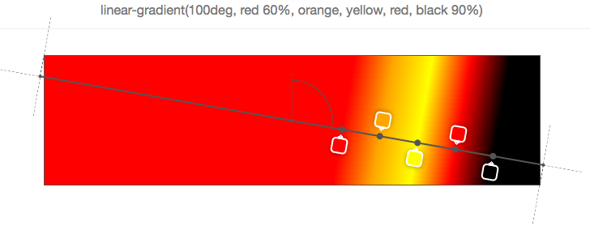

   可见，第一个和最后一个都被定位了，而其余的色标则均匀的分布在这两个点之间。

   再离谱点的复杂（**有色标超过100%，也可以为负值，即比0%还要小**）：

   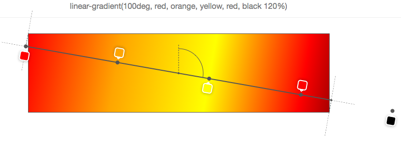

   如果0%和100%是色标定位的最小值和最大值，那么不管色标混合多复杂，都会变得简单起来。然而，实际情况是，我们可以超过100%，正如上图所示的那样（最后一个色标120%），而这意味着**其它所有的色标都必须根据该位置分配**（**在这种情况下，默认起始位置保持为0％**）

   简单来说，你不能把最后一个色标当作是真正的100%来看待，即便它们俩效果一致，但这只是计算结果的一致罢了

   小于0%的情况：
   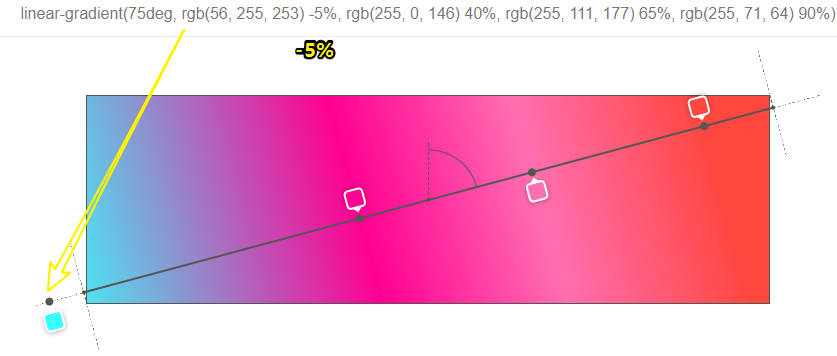

   再无厘头的复杂（**色标定位的百分比是无序的**）：

   事实上色标是有序的，但是这没有什么方法可以防止你不这样做，如果你不这样做，就不会发生任何可怕的事情，如果你真得这样做了，也没事，因为浏览器会纠正你，就像这样：

   

   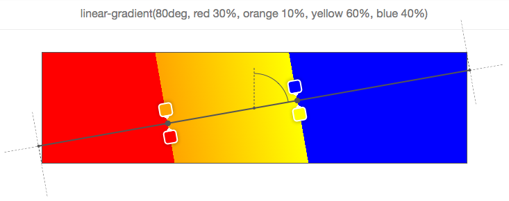

   第一个色标的开始，定位在30%，这很好。而第二个色标定位在10%，但这是错误的，因为色标的停止点是一个增量。所以浏览器会自动纠正，即把第二个色标定位在上一个色标的30%那里去，而这样一来，它们俩之间也就没有所谓的渐变色了。同理，后面也是这样的纠正规则。

   > 一个认识：**下一个色标对于上一个色标来说，是个停止点**。
   >
   > 总之，如果后面的值比前面的值更小时，浏览器会自动做相应的纠正处理

   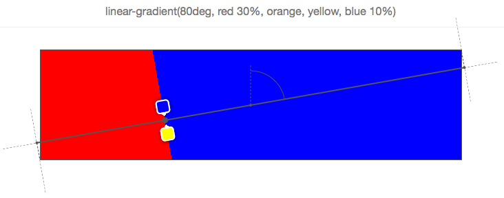

   上边这个是最后一个例子，显而易见的是最后一个色标的定位是错误的，所以浏览器就自动的把其位置弄成是其上一个色标的那个定位位置了，即30%。需要注意的是，在这种情况之下，并没有出现剩余色标会平分70%的空间，而是由于orange和yellow这两个色标因为受到最后一个色标的影响，都定位到30%那个位置了，而最后一个则是带着它的蓝色回到了30%。

   总之orange和yellow这两个色标写不写都是一样的效果。

   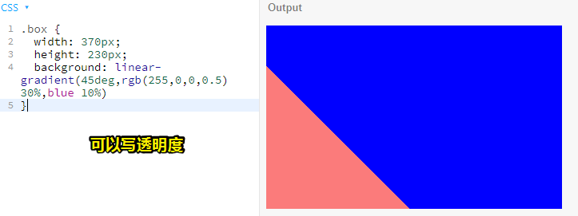

   如果，你有头，尾巴不是100%：

   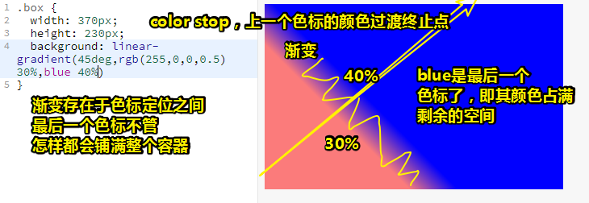

   如果，你有头，尾巴是100%，那么就会从30%过渡到100%了：

   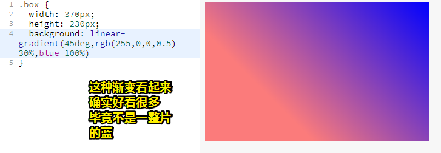

一个线性渐变可视化工具：

**➹：**[CSS linear-gradient overlay](https://codepen.io/captainbrosset/pen/ByqRMB)

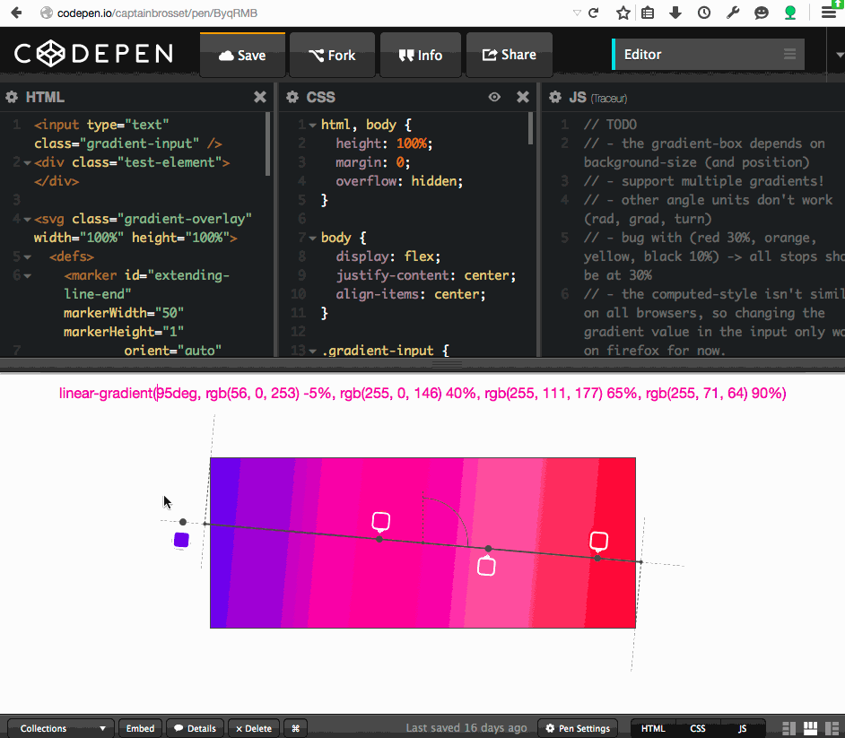

你可以在输入框中输入任何一个渐变的值，你可以看到渐变效果以及渐变线，渐变角度和渐变颜色的位置，之前的截图都是来自于此。当然，这个工具还存在各种各样的缺陷和局限，所以不要有过高的期望，当然，你也可以在这个基础上完善这个工具（如改一下渐变容器的大小），**帮助大家更好的理解渐线渐变**。


有这样一份代码：

```html
<div class="box"></div>
```

```css
.box {
    width: 300px;
    height: 300px;
    background: linear-gradient(
        -45deg,
        white 0%,
        white 25%,
        hotpink 25%,
        hotpink 50%,
        white 50%,
        white 75%,
        hotpink 75%,
        hotpink 100%);
    background-size: 10%;
}
```

它的效果是这样的：

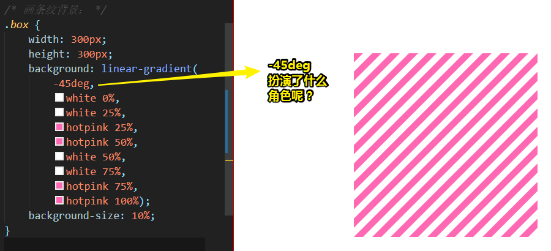

而在chrome里边的效果是这样的：

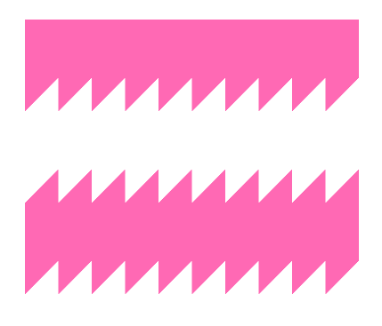

真是奇葩的渲染啊！完全弄不明白chrome画的是什么玩意儿……

经过测试得知， 渐变容器默认是180deg的，即颜色按传参顺序从上到下分布，即第一个色标在正上方。如果调整为0%，那么渐变线逆时针旋转了半圈，此时第一个色标在正下边。如果调整为-45deg，那么继续逆时针45deg，此时第一个色标正下边与右下角之间，由于这是个正方形容器，所以-45deg的渐变线会贯穿正方形的对角线，颜色的起始点为右下角。

结合`background-size: 10%;`，这其实是100个小背景图所呈现的结果。

可是，chrome为啥会呈现这样的结果呢？查了一下can i use，这些属性显然都是支持的呀

于是，我根据呈现的效果猜测：`background-size: 10%;`的第二个参数，你得写上10%才行，而且即便你写了为auto也不行。

**➹：**[`<gradient>` - CSS: Cascading Style Sheets - MDN](https://developer.mozilla.org/en-US/docs/Web/CSS/gradient)

**➹：** [CSS gradient渐变之webkit核心浏览器下的使用 « 张鑫旭-鑫空间-鑫生活](https://www.zhangxinxu.com/wordpress/2010/04/css-gradient%E6%B8%90%E5%8F%98%E4%B9%8Bwebkit%E6%A0%B8%E5%BF%83%E6%B5%8F%E8%A7%88%E5%99%A8%E4%B8%8B%E7%9A%84%E4%BD%BF%E7%94%A8/)

**➹：**[你真的理解CSS的linear-gradient？_CSS3, gradient 教程_w3cplus](https://www.w3cplus.com/css3/do-you-really-understand-css-linear-gradients.html)

**➹：**[Do you really understand CSS linear-gradients? – Medium](https://medium.com/@patrickbrosset/do-you-really-understand-css-linear-gradients-631d9a895caf)

**➹：**[CSS Gradients - CSS-Tricks](https://css-tricks.com/css3-gradients/)

### ②background-size的百分比？

`background-size: 30%;`

这里只有一个值，表示图片的宽度为所应用元素的宽度的30%，而高度则是 `auto`

所以下边这代码就很好解释了：

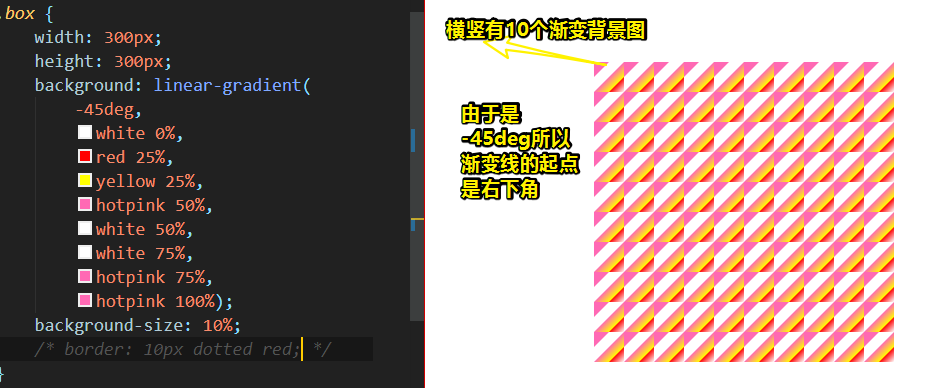

可见，这背景图自动repeat了。

**➹：**[background-size - CSS: Cascading Style Sheets - MDN](https://developer.mozilla.org/en-US/docs/Web/CSS/background-size)

### ③堆叠上下文？


**➹：**[深入理解CSS中的层叠上下文和层叠顺序 « 张鑫旭-鑫空间-鑫生活](https://www.zhangxinxu.com/wordpress/2016/01/understand-css-stacking-context-order-z-index/)

### ④用repeating-linear-gradient代替linear-gradient？

之前用了linear-gradient写渐变：

```css
.box {
    width: 300px;
    height: 300px;
    background: linear-gradient(
        -45deg,
        white 0%,
        white 25%,
        hotpink 25%,
        hotpink 50%,
        white 50%,
        white 75%,
        hotpink 75%,
        hotpink 100%);
    background-size: 10% 10%;
}
```

然而还有一种函数，可以方便快捷的做到，那就是我们之前提到的 `repeating-linear-gradient`啦

它的用法同 `linear-gradient`一样，即会传一样的参数，只是它会朝四面八方无限地重复色标，其返回值同样是 `<image>`类型里边的一种。


### ⑤`transparent`是一种怎样的值？它与 `opacity:0`有区别吗？

transparent就像你写red一样，它表示颜色的一种——透明色，视觉上看相当于看不见颜色，类似于 `opacity：1`的视觉呈现。

总之你怎么看red，那么你就怎么看transparent

而`opacity:0`表示元素是透明的，这其中还包括内容，即该属性可以被继承。

关于rgba的a，这个a同样用于设置透明度，但是它并不会被继承，毕竟我们要么用于color属性，background属性。

总之，一个只针对一个人，一个针对的是一群人。

**➹：**[css中background-color:transparent与opacity:0有什么区别？ - 知乎](https://www.zhihu.com/question/20330932)

### ⑥What is Lorem Ipsum?

这只是一段用来测试排版效果的占位文字，没有实际的含义。

总之，就是一段假文，看起来好像有很多中文或单词，实际上内容毫无逻辑。

生成有逻辑的假文：[malevole - 文本生成器](http://www.malevole.com/mv/misc/text/)

**➹：**[关于Lorem ipsum - 阮一峰的网络日志](http://www.ruanyifeng.com/blog/2009/04/lorem_ipsum.html)

**➹：**[设计中经常看到的Lorem ipsum是什么意思？ - 简书](https://www.jianshu.com/p/e6fdd2dce19c)

**➹：**[超实用！12个你应该知道的中英文假字+文章在线生成网站 - 优设网 - UISDC](https://www.uisdc.com/12-lorem-ipsum-generator)

**➹：**[Lorem Ipsum - All the facts - Lipsum generator](https://www.lipsum.com/)

