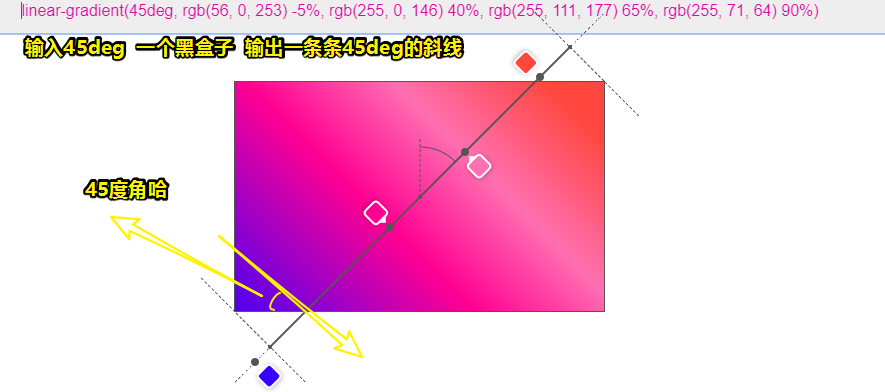
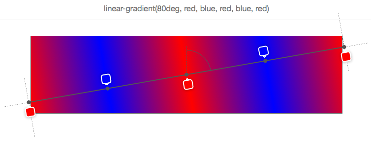

# 如何用纯 CSS 创作一个容器厚条纹边框特效

## ★资源

**➹：**[前端每日实战：3# 视频演示如何用纯 CSS 创作一个容器厚条纹边框特效 - 前端每日实战 - SegmentFault 思否](https://segmentfault.com/a/1190000014576519)

**➹：** <https://scrimba.com/c/cPvn6tE>

## ★源码

**➹：**<https://github.com/comehope/front-end-daily-challenges/tree/master/003-diagonal-stripe-border-effects>

## ★预览效果


## ★知识点


## ★总结


## ★Q&A

### ①linear-gradient？

关于渐变，它是**一种应用于平面的视觉效果**，可以从**一种颜色逐渐地转变成另外一种颜色**，故可以创建类似于彩虹的效果渐变可以应用在**任何可以使用图片的地方**。

举例来说，你可以指定这么一个渐变：

顶部的颜色是红色，中间的是蓝色，底部为黄色来作为div的背景色。

那么我们该如何实现渐变呢？——很简单，CSS给了我们以下这几种方式实现（它们都是渐变函数，是`background`这位魔法师可以使用的其中一门魔法，而使用这类魔法之后，显而易见的就是，我们**不用再写背景图片的URL**，总之，**渐变函数可以用来代替图片URL**）：

1. `background: linear-gradient(#f69d3c, #3f87a6);`：线性渐变

   

2. `background: radial-gradient(#f69d3c, #3f87a6);`：径向渐变

   

3. `background: repeating-linear-gradient(#f69d3c, #3f87a6 50px);`：重复的线性渐变

   

4. `background: repeating-radial-gradient(#f69d3c, #3f87a6 50px);`：重复的径向渐变

   

   这看起来有锯齿呀！一点也不圆润

5. `background: conic-gradient(#f69d3c, #3f87a6);`：圆锥形渐变

   

   这个真是奇葩……

需要注意的是：

1. **`<gradient>`** （[CSS数据类型](https://developer.mozilla.org/en-US/docs/Web/CSS/CSS_Types)的一种）是 `<image>` 的一种特殊类型，简单来说，就是它的子类型，表示由**两种或多种颜色**之间的渐进式的过渡组成，总之，就是你使用了渐变函数，那么你就**不能只写一个颜色参数值，毕竟你不能抢了背景色的活儿啊**！

2. 具体尺寸将与其（CSS渐变）**所应用的元素的尺寸相匹配**，总之CSS渐变它没有没有[内在尺寸](https://developer.mozilla.org/en-US/docs/CSS/image#no_intrinsic)，就像个不失真的背景图片一样。

3. 渐变的显示区域，边框下也会显示，即  它的显示区域就是元素的`border-box`区域

   
   
   > 背景颜色和背景图片也是如此。可见渐变函数的出现，是实打实的减少了请求背景图片为渐变色图片的url呀！

以下讨论的是`linear-gradient`：

一些概念：

1. gradient box：需要应用渐变的元素被称为**渐变容器或者说是渐变框**

2. gradient line：在渐变容器中，穿过容器中心点和颜色停止点（color stops）连接在一起的线称为**渐变线**

3. gradient angle：使用`linear-gradient`是通过渐变的角度来控制渐变的方向

4. color stops：它是线性渐变函数的第二个参数（或者说第3个、第4个（如果有的话）也是这样的参数……），表示终止点的颜色，即接受一系列颜色节点

   

   `C`点为渐变容器的中心点，`A`是通过`C`点垂直线与通过`C`点渐变线的夹角，这个角称为**渐变角度**。

如何定义渐变角度？——有两种姿势：

1. 使用关键字： *to top*, *to bottom*, *to left*, *to right*, *to top right*, *to top left*, *to bottom right*, *to bottom left*
2. 使用「数字+单位」： *45deg, 1turn, …*

不写渐变角度？——我们知道线性渐变的语法：

`linear-gradient([<angle> | to <side-or-corner>]? , <color-stop-list>)`

第一个参数是可选的，既然是可选的，那么它是有默认值的，其默认值为*to bottom*，等价于`180deg`或者 `.5turn`：


> 注意：红色色标是指南针的箭头，默认用圆规从上到下画了个半圆

同理，如果你写了 `0deg`，那么其值等价于 *to top*


> 此时的箭头在容器的top点，用圆规从下到上画了个半圆。换而言之，线性渐变颜色默认是从上到下的，与传入的颜色色标参数顺序是一一对应的

渐变角度关键字取决于渐变框的尺寸：

何以见得？

举个栗子你就明白了：


`45deg`等价于 `to top right`，但这并不意味着渐变线穿过右上角，毕竟这TM不是一个正方形呀！而是一个长方形呀！总之，你要通过角度和通过元素中心点的垂直线来确定渐变线，而且你要渐变线的箭头指向是哪个方向，毕竟我们要确定填充色标的顺序呀！

> 我有疑问：它是个矩形，为啥45deg的渐变颜色填充却是对角的？真是无法理解呀！或许自己可以在脑海中把这个渐变容器补充完整为一个正方形。
>
> 我测试了一下：
>
> 
>
> 难怪矩形的顶点有个十字线。
>
> 所以我们写上45deg所呈现的渐变效果，真得是如同自己在这个渐变框里边画一条条的45deg角的斜线。
>
> 
>
> **➹：**[CSS linear-gradient overlay](https://codepen.io/captainbrosset/pen/ByqRMB)

一图告知你**渐变角度动态变化时，渐变线是怎么移动的**：


关于渐变线长度：


在上图中，我们可以看到，颜色色标脱离到容器之外了，即渐变线可以大于元素容器的对角线，而其最小的长度刚好为元素的高度。当然，我们有个公式可以计算它的确切高度：

```
abs（W * sin（A））+ abs（H * cos（A））
```

> W为渐变框的宽，H为高度，A为渐变角。可见这几个值都是已知的。


关于渐变色节点（色标，Color stops）：

1. 每个色标的定义（以逗号分割）：

   ```
   <color> [<percentage> | <length>]?
   ```

2. 色标的第二个值是可选的，用于确定色标在渐变线上的位置。

3. 如果没有显式指定颜色在渐变线上的位置，这将交给浏览器来确定颜色在渐变线上的位置：

   1. 默认情况下，即最简单的情况下，只有2种颜色：**颜色1将被置于0％（渐变线的开始），颜色2将被置于100％（渐变线的末端）。**
   2. 如果添加第三种颜色：**颜色1仍为0％，颜色2为50％，颜色3为100％，依此类推。**
   
   举个栗子，定义了5个色标：
   
   
   
   可见，浏览器已将色标各自的位置计算为0％，25％，50％，75％，100％，而这样做的原因是**它们将沿着渐变线平均（或者说是均匀）分布渐变颜色。**

4. 在渐变线上**显式自定义渐变颜色在渐变线的位置**，每个位置可以用百分比表示（**相对于渐变线计算**），也可以是**任何一个CSS长度单位**：

   如这样：

   

   可见，5个色标中的每一个都有位置，以像素为单位，而这些位置是从渐变线的起点计算出来的。

   > 每个色标所对应的那一点就是我们在CSS里边所写的颜色，色标之间的过渡，是渐进式的变化的，这种颜色的填充是浏览器帮我们勾画出来的。

利用色标在渐变线上的位置，可以想出各种不错的效果：

1. 使用渐变函数但完全不绘制任何渐变效果，即存粹的呈现多种颜色：

   

   有7个色标，它们的组织方式是，除了第一个色标以外，下一个色标的开始与上一个色标完全位于相同的位置，而这意味着浏览器不需要使用颜色渐变来填充2个色标之间的空间。

   这像是棋盘图：

   

2. 把定位的色标和没有定位的色标混合起来：

   

   可见，我们这样做使浏览器做了更多的工作，毕竟，我们要求它自动分配我们没有写位置的色标。

   那么这个orange色标的位置是如何确定的呢？

   由于它的左右直接邻居都有位置，所以很容就能确定它的位置了，即为直接邻居之间的中心点。

   **但如果有多个颜色没有指定位置，或者前一个或后一个都没有指定位置，那它就变得越来越复杂。** 

   > 自己定义一个概念：
   >
   > 有两种色标，一种显示给了位置，一种没有给位置，而说到色标混合，指的是两种色标的混合。

3. 色标混合之复杂情况（**头尾色标没位置**）：

   

   可见，只有黄色有位置（位于30%），其余的色标都没有位置。

   为了很好地分配其余的色标，于是，浏览器将第一个放在0％，最后一个放在100％，而这样一来剩下的色标都有位置了，即它们的直接邻居都是有位置的，所有orange最终在0％至30％之间，red（最后那个）最终在30％~100％之间，总之，它们俩都是在中心位置。

   再复杂点（**头尾色标有位置**）：

   

   可见，第一个和最后一个都被定位了，而其余的色标则均匀的分布在这两个点之间。

   再离谱点的复杂（**有色标超过100%，也可以为负值，即比0%还要小**）：

   

   如果0%和100%是色标定位的最小值和最大值，那么不管色标混合多复杂，都会变得简单起来。然而，实际情况是，我们可以超过100%，正如上图所示的那样（最后一个色标120%），而这意味着**其它所有的色标都必须根据该位置分配**（**在这种情况下，默认起始位置保持为0％**）

   简单来说，你不能把最后一个色标当作是真正的100%来看待，即便它们俩效果一致，但这只是计算结果的一致罢了

   小于0%的情况：
   

   再无厘头的复杂（**色标定位的百分比是无序的**）：

   事实上色标是有序的，但是这没有什么方法可以防止你不这样做，如果你不这样做，就不会发生任何可怕的事情，如果你真得这样做了，也没事，因为浏览器会纠正你，就像这样：

   

   

   第一个色标的开始，定位在30%，这很好。而第二个色标定位在10%，但这是错误的，因为色标的停止点是一个增量。所以浏览器会自动纠正，即把第二个色标定位在上一个色标的30%那里去，而这样一来，它们俩之间也就没有所谓的渐变色了。同理，后面也是这样的纠正规则。

   > 一个认识：**下一个色标对于上一个色标来说，是个停止点**。
   >
   > 总之，如果后面的值比前面的值更小时，浏览器会自动做相应的纠正处理

   

   上边这个是最后一个例子，显而易见的是最后一个色标的定位是错误的，所以浏览器就自动的把其位置弄成是其上一个色标的那个定位位置了，即30%。需要注意的是，在这种情况之下，并没有出现剩余色标会平分70%的空间，而是由于orange和yellow这两个色标因为受到最后一个色标的影响，都定位到30%那个位置了，而最后一个则是带着它的蓝色回到了30%。

   总之orange和yellow这两个色标写不写都是一样的效果。

   

   如果，你有头，尾巴不是100%：

   

   如果，你有头，尾巴是100%，那么就会从30%过渡到100%了：

   

一个线性渐变可视化工具：

**➹：**[CSS linear-gradient overlay](https://codepen.io/captainbrosset/pen/ByqRMB)


你可以在输入框中输入任何一个渐变的值，你可以看到渐变效果以及渐变线，渐变角度和渐变颜色的位置，之前的截图都是来自于此。当然，这个工具还存在各种各样的缺陷和局限，所以不要有过高的期望，当然，你也可以在这个基础上完善这个工具（如改一下渐变容器的大小），**帮助大家更好的理解渐线渐变**。


有这样一份代码：

```html
<div class="box"></div>
```

```css
.box {
    width: 300px;
    height: 300px;
    background: linear-gradient(
        -45deg,
        white 0%,
        white 25%,
        hotpink 25%,
        hotpink 50%,
        white 50%,
        white 75%,
        hotpink 75%,
        hotpink 100%);
    background-size: 10%;
}
```

它的效果是这样的：


而在chrome里边的效果是这样的：


真是奇葩的渲染啊！完全弄不明白chrome画的是什么玩意儿……

经过测试得知， 渐变容器默认是180deg的，即颜色按传参顺序从上到下分布，即第一个色标在正上方。如果调整为0%，那么渐变线逆时针旋转了半圈，此时第一个色标在正下边。如果调整为-45deg，那么继续逆时针45deg，此时第一个色标正下边与右下角之间，由于这是个正方形容器，所以-45deg的渐变线会贯穿正方形的对角线，颜色的起始点为右下角。

结合`background-size: 10%;`，这其实是100个小背景图所呈现的结果。

可是，chrome为啥会呈现这样的结果呢？查了一下can i use，这些属性显然都是支持的呀

于是，我根据呈现的效果猜测：`background-size: 10%;`的第二个参数，你得写上10%才行，而且即便你写了为auto也不行。

**➹：**[`<gradient>` - CSS: Cascading Style Sheets - MDN](https://developer.mozilla.org/en-US/docs/Web/CSS/gradient)

**➹：** [CSS gradient渐变之webkit核心浏览器下的使用 « 张鑫旭-鑫空间-鑫生活](https://www.zhangxinxu.com/wordpress/2010/04/css-gradient%E6%B8%90%E5%8F%98%E4%B9%8Bwebkit%E6%A0%B8%E5%BF%83%E6%B5%8F%E8%A7%88%E5%99%A8%E4%B8%8B%E7%9A%84%E4%BD%BF%E7%94%A8/)

**➹：**[你真的理解CSS的linear-gradient？_CSS3, gradient 教程_w3cplus](https://www.w3cplus.com/css3/do-you-really-understand-css-linear-gradients.html)

**➹：**[Do you really understand CSS linear-gradients? – Medium](https://medium.com/@patrickbrosset/do-you-really-understand-css-linear-gradients-631d9a895caf)

**➹：**[CSS Gradients - CSS-Tricks](https://css-tricks.com/css3-gradients/)

### ②background-size的百分比？

`background-size: 30%;`

这里只有一个值，表示图片的宽度为所应用元素的宽度的30%，而高度则是 `auto`

所以下边这代码就很好解释了：


可见，这背景图自动repeat了。

**➹：**[background-size - CSS: Cascading Style Sheets - MDN](https://developer.mozilla.org/en-US/docs/Web/CSS/background-size)

### ③堆叠上下文？


**➹：**[深入理解CSS中的层叠上下文和层叠顺序 « 张鑫旭-鑫空间-鑫生活](https://www.zhangxinxu.com/wordpress/2016/01/understand-css-stacking-context-order-z-index/)

### ④用repeating-linear-gradient代替linear-gradient？

之前用了linear-gradient写渐变：

```css
.box {
    width: 300px;
    height: 300px;
    background: linear-gradient(
        -45deg,
        white 0%,
        white 25%,
        hotpink 25%,
        hotpink 50%,
        white 50%,
        white 75%,
        hotpink 75%,
        hotpink 100%);
    background-size: 10% 10%;
}
```

然而还有一种函数，可以方便快捷的做到，那就是我们之前提到的 `repeating-linear-gradient`啦

它的用法同 `linear-gradient`一样，即会传一样的参数，只是它会朝四面八方无限地重复色标，其返回值同样是 `<image>`类型里边的一种。


### ⑤`transparent`是一种怎样的值？它与 `opacity:0`有区别吗？


transparent就像你写red一样，它表示颜色的一种——透明色，视觉上看相当于看不见颜色，类似于 `opacity：1`的视觉呈现。

总之你怎么看red，那么你就怎么看transparent

而`opacity:0`表示元素是透明的，这其中还包括内容，即该属性可以被继承。

关于rgba的a，这个a同样用于设置透明度，但是它并不会被继承，毕竟我们要么用于color属性，background属性。

总之，一个只针对一个人，一个针对的是一群人。

**➹：**[css中background-color:transparent与opacity:0有什么区别？ - 知乎](https://www.zhihu.com/question/20330932)

### ⑥What is Lorem Ipsum?

这只是一段用来测试排版效果的占位文字，没有实际的含义。

总之，就是一段假文，看起来好像有很多中文或单词，实际上内容毫无逻辑。

生成有逻辑的假文：[malevole - 文本生成器](http://www.malevole.com/mv/misc/text/)

**➹：**[关于Lorem ipsum - 阮一峰的网络日志](http://www.ruanyifeng.com/blog/2009/04/lorem_ipsum.html)

**➹：**[设计中经常看到的Lorem ipsum是什么意思？ - 简书](https://www.jianshu.com/p/e6fdd2dce19c)

**➹：**[超实用！12个你应该知道的中英文假字+文章在线生成网站 - 优设网 - UISDC](https://www.uisdc.com/12-lorem-ipsum-generator)

**➹：**[Lorem Ipsum - All the facts - Lipsum generator](https://www.lipsum.com/)

### ⑦rem单位作用范围？

我知道rem一般都是作用于字体font-size的，可是padding、margin、width、height、border-width、text-shadow等属性需要写成rem吗？

关于对一些单位的认识：

> 百分比的CSS数据类型为 ` <length-percentage>`，而不是 `<length>`

- em和rem，通常用于创建可伸缩的布局，即使用户更改字体大小，这些布局也能保持页面的垂直韵律。em是相对单位，如果当前元素重新设置了字体大小了，那么就相对于该元素，如果没有，那么就是相对于继承而来的font-size值。rem相对的是根元素（通常是html元素）的font-size值，一般浏览器默认根元素的值为16px，但是用户可以自行设定。

  它们俩的区别：rem是以根元素为参照物的 em 单位

- px按照我之前的理解是相对定位，因为不同设备下的分辨率是不同的，其1个px可能代表的不是1个物理像素，而是多个。不过MDN说它是绝对单位我也无法可说。

  

  一般屏幕上1个px为0.03cm=0.3mm。

- cm：它是绝对单位呀，在PC上1cm大约就是（96px/2.54）38px了，不过这是1in为96px的情况，简单来说，就是1斤为96个小果子，每个果子为1/96斤，即1个px为1/96in。

回过头来看rem。

话说为啥需要rem呢？

假如在根元素的文字大小为默认值 `16px` 的情况下，我们想要所有列表的字体大小均为 `12px` :

```css
html {
  font-size: 100%; //16px
}

ul {
  font-size: 0.75em;
}
```

如果存在嵌套的ul元素，如：

```html
<ul>
  <li>
    <ul>
    	<li></li>
    </ul>
  </li>
</ul>
```

效果类似于这样：

- 第一个ul的li
  - 第二个ul的li

那么第二个ul的下的font-size就是9px了。

当然，如果你写成这样就没事了：

```css
ul ul {
  font-size: 1em; //第一个ul为12px，所以第二个继承过来的12px*1也是12px
}
```

可是这样做岂不是耦合了第一个ul？

所以我们应该用rem，这样会简单很多：

```css
html {
  font-size: 100%;
}

ul {
  font-size: 0.75rem;
}
```

**当所有尺寸都以根元素的文字大小作为参照后，就不再需要为嵌套的元素单独定义样式了**。

不过使用rem为单位的数值就是计算起来非常不方便，比如0.75rem（`0.75*16=12px`）、1rem（`1*16=16px`）、1.125rem（`1.125*16 = 18px`）等这样的

那么如何解决计算不方便的问题呢？

1. 使用62.5大法，把根元素的默认16px改为62.5%，即为10px。至此我们写成0.75rem，就能一眼看出来是7.5px了……当然，我们一般写成是1.2rem，即为12px……

   虽然解决了计算不方便，但这会迫使开发者重写他们网站中的所有文字大小。比如我们之前写的是0.75rem，那么现在就得是1.2rem了。

2. 根元素的长度单位依旧采用 `px` ，模块用 rem 单位，模块内的元素使用 em 单位：

   ```css
   /* Document level adjustments */
   html {
     font-size: 17px;
   }
   @media (max-width: 900px) {
     html { font-size: 15px; }
   }
   @media (max-width: 400px) {
     html { font-size: 13px; }
   }
   
   /* Modules will scale with document */
   .header {
     font-size: 1.5rem;
   }
   .footer {
     font-size: 0.75rem;
   }
   .sidebar {
     font-size: 0.85rem;
   }
   
   /* Type will scale with modules */
   h1 {
     font-size: 3em;
   }
   h2 {
     font-size: 2.5em;
   }
   h3 {
     font-size: 2em;
   }
   ```

   **这种方式可以很容易的操作根元素的大小，至此缩放模块也不再话下了。而模块内内容的大小以模块自身文字大小来进行缩放**。

   > 根px，模rem，内em。
   >
   > em可用于margin、padding、width、max-width、height、 top、right、border、 border-radius等

关于在媒体查询中使用 rem 单位：

> 在 HTML 中，**em 单位与用户浏览器或者用户偏好设置中设置的初始文字大小有关，而不是页面上的样式中定义的文字大小**

如下面是两条媒体查询语句，一条是使用 rem 单位，另一条使用 em 单位（这里为了简便，使用了 Sass）：

```css
html {
  font-size: 62.5%; /* 62.5% of 16px = 10px */

  @media (min-width: 20rem) { 
    /* 20*16px = 320px */
    background-color: lemonchiffon;
    font-size: 200%;
    /* 200% of 16px = 32px */
  }

  @media (min-width: 30em) {
    /* 30*16px = 480px */
    background-color: lightblue;
    font-size: 300%; /* 300% of 16px = 48px */（译：原文是48px）
  }
}
```

你认为media会理会html的font-size的10px？——不，它不会。

你可看到，我们使用了62.5大法，然而修改根元素字体大小不会对媒体查询产生任何影响。

即当设备宽度为320px时，该媒体查询就会起效果了，而不是200px；同理300px也不会起效果。而且其里边的内容也是无视62.5大法。

总之，唯一一个可以改变媒体查询中宽度的是在浏览器里更改默认文字大小。

因此，在媒体查询语句中使用 em 单位还是 rem 单位已经不那么重要。而在现实中，无论是[Foundation v5](http://foundation.zurb.com/)还是最近刚发布的[Bootstrap v4 alpha](http://v4-alpha.getbootstrap.com/)都在他们的媒体查询中使用了 em 单位。

当然，如果你要做缩放文档的话，那么我建议你使用rem单位：

我们使用 rem 来定义元素的宽度、外边距和内边距 ，通过使用根元素的字体大小作为一个接口使元素缩放一致变为了可能。

[demo](https://codepen.io/SitePoint/pen/EVmwjZ/)

> 不过，就目前而言，一般都会用vh和vw来做响应式

---

**➹：**[分辨率与比例尺 - ParamousGIS - 博客园](https://www.cnblogs.com/gispathfinder/p/6087566.html)

**➹：**[`<length>` - CSS: Cascading Style Sheets - MDN](https://developer.mozilla.org/en-US/docs/Web/CSS/length)

**➹：** [了解并使用 CSS 中的 rem 单位 - 众成翻译](https://www.zcfy.cc/article/understanding-and-using-rem-units-in-css-1411.html)

**➹：**[Font Size Idea: px at the Root, rem for Components, em for Text Elements - CSS-Tricks](https://css-tricks.com/rems-ems/)

**➹：**[The Power of em Units in CSS — SitePoint](https://www.sitepoint.com/power-em-units-css/)

**➹：**[Rem布局的原理解析](https://yanhaijing.com/css/2017/09/29/principle-of-rem-layout/)

### ⑧background这个属性？

关于颜色：

有多种表示法（如#、rgb、hsl、rgba、hsla），但是这不过是表示同一种事物的不同方法罢了

> 注意点：文本与背景的对比度不能太低了，不然强光下看网页那就GG了。推荐个颜色对比度参考网站：
>
> **➹：**[Contrast Rebellion - to hell with unreadable, low-contrast texts!](https://contrastrebellion.com/)

我们使用图片有两种姿势：

- 一种是HTML姿势的img元素——内容图片
- 一种是CSS姿势的`url()`——背景图片

那么何时使用它们呢？

图片咩有意义，只是起到装饰作用，那么可以用背景图片，当然，装饰有时候也是一种意义，比如你去掉图片发觉对整个网站的观感完全变了一个样，那么此时你可以用内容图片。

关于对背景图片使用的注意点：

- 以防元素的背景图片加载失败，你最好添加个背景色

回到background这个属性：

它是个简写属性，你写了这个属性，然后你只写了一个color值，那么这意味着它的其它没有显示写出来的值是默认值。

> 如果你在写background属性之前，用到了background-color之类的属性，那么它们就会被background给覆盖掉，毕竟CSS它有层叠性啊。

探讨background其它的值：

1. background-repeat：
   - 默认值：repeat（背景图沿x和y轴重复，适合花纹图案的背景图，不适合照片）
   - 其它值：repeat-x（只沿x轴重复）、repeat-y（只沿y轴重复）、no-repeat（不重复，适合照片）
   - 进化：
     1. 扩展语法（本来只有单值语法，现在则多了双值语法）：可以同时写两个值（前x后y），如 `background-repeat：repeat no-repeat;`等价于 `repeat-x`
     2. 新增关键字：space（不变形，可以用间隙弥补填不满）和round（图片会变形，因为需要填满，而且还得重复为整数），它们俩可以同时设置，也可以单独设置。那么它们何时用呢？其实它们并咩有多大用处，不过常用于让设计保持某种对称性。
2. background-image：

